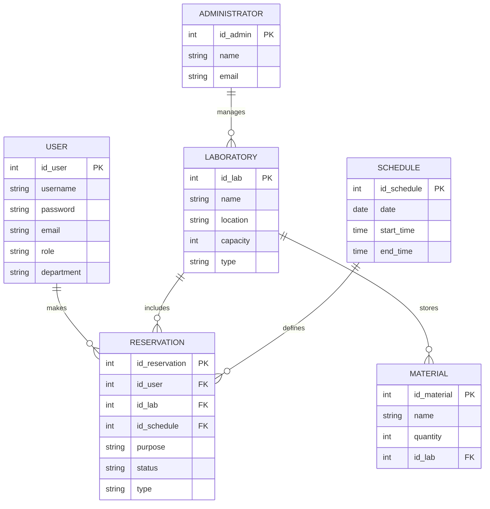
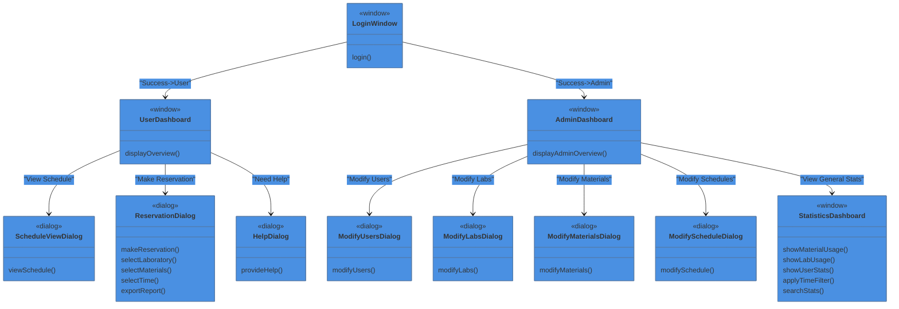

## Proponer el Proyecto

**LabTimeManager**
Justificación...

1. **Complejidad de la Gestión de Horarios:** Los laboratorios suelen tener una alta demanda de uso y recursos limitados, lo que hace que la gestión de horarios sea compleja. Un sistema automatizado puede ayudar a asignar y gestionar los horarios de manera eficiente, evitando conflictos y optimizando la utilización de los recursos.

2. **Diversidad de Usuarios:** En un laboratorio, pueden haber diferentes tipos de usuarios, como investigadores, estudiantes, técnicos, etc. Un sistema de gestión de horarios puede adaptarse para satisfacer las necesidades de cada tipo de usuario, asignando permisos y privilegios según corresponda.

3. **Seguimiento y Control:** Con un sistema de gestión de horarios, es posible llevar un registro detallado de quién utiliza el laboratorio, cuándo y para qué propósito. Esto facilita el seguimiento, la supervisión y el control de la actividad en el laboratorio.

4. **Integración de Recursos:** Además de gestionar los horarios de uso del laboratorio, el sistema puede integrarse con otros recursos, como equipos especializados, materiales, y reservas de espacios adicionales dentro del laboratorio.

5. **Facilidad de Acceso y Reservas:** Los usuarios pueden acceder al sistema desde cualquier lugar para verificar la disponibilidad de horarios y realizar reservas según sus necesidades. Esto reduce la necesidad de coordinación manual y permite una mayor flexibilidad en la programación.

6. **Generación de Reportes:** El sistema puede generar informes y estadísticas sobre el uso del laboratorio, lo que puede ser útil para la toma de decisiones, la planificación de recursos y la justificación de inversiones adicionales en el laboratorio.

## Requerimientos del proyecto
- Login para iniciar sesión como usuario/administrador
- Ventana para el usuario:
	- Dialogo: Vista de horario (tabla)
	- Dialogo: Reservación
		- Seleccionar laboratorio
		- Seleccionar materiales
		- Seleccionar hora
		- Exportar reporte (botón)
	- Dialogo: Ayuda o cancelar
- Ventana para el administrador
	- Dialogo: Modificar usuarios
	- Dialogo: Modificar laboratorios
	- Dialogo: Modificar material
	- Dialogo: Modificar horarios
- Botón: Exportar como creación de reportes al momento de crear una reservación por parte del usuario, donde se expliquen todos los detalles, exportar con formato adecuado en PDF para enviarse de forma automática al correo del usuario.
- Ventana (Dashboard) donde se muestren gráficos y esquemas sobre el uso de estadísticos sobre el uso de materiales, laboratorios.
	- Gráfico de usos de materiales más usados
	- Gráfico de uso de laboratorios
	- Gráfico de usuarios que más usen el laboratorio
	- Filtro de tiempo (mes, año)
	- Búsqueda para obtener estadísticas sobre un usuario, laboratorio, material, etc.

## UML del proyecto

## Tecnologías
- Java
- MySQL

